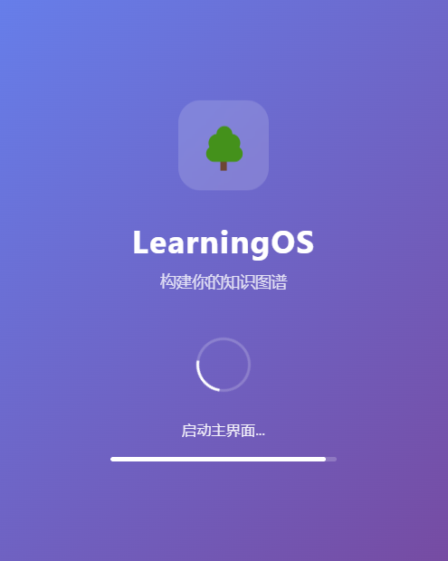
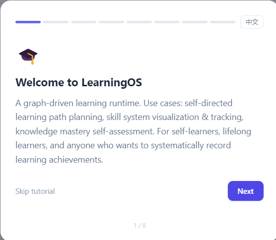

# LearningOS

一个基于知识图谱的学习管理系统，帮助你构建和追踪学习路径。

## ✨ 功能特性

- 🗺️ **知识图谱**: 将学习内容组织成可视化的技能树，支持拖拽平移导航
- 🎯 **任务模式**: 设定学习目标，自动规划最优路径，支持直接双击节点激活
- 📊 **进度追踪**: 记录学习进度，支持实时学习记录和评分
- ⭐ **XP 系统**: 经验值与等级系统，完成节点获得经验值
- 👑 **Boss 奖励**: 完成里程碑节点获得额外经验值加成
- 🏆 **成就系统**: 约 20 个成就，展示学习成果
- 📈 **熟练度系统**: 5 级熟练度（完成/熟悉/掌握/熟练/精通），影响 XP 加成
- ↩️ **撤销功能**: 支持无限步撤回，包含级联撤销
- 📱 **桌面应用**: 支持 Windows 桌面客户端 (Electron)
- 🔄 **待实现功能**: 上传附件，图片形式分享进度......

## 🛠️ 技术架构

- **前端**: Next.js 14 + React 18 + TypeScript + TailwindCSS
- **后端**: FastAPI + Python 3.10+
- **桌面**: Electron 28

## 🚀 快速开始

你可以选择以下任一方式运行 LearningOS：

---

### 📦 方式一：直接使用（普通用户推荐）

**无需安装 Python 或 Node.js 环境！**

我们提供了已打包好的 Windows 桌面应用，开箱即用：

1. **下载安装包**：前往 [GitHub Releases](https://github.com/KcirtW0009/LearningOS/releases) 下载最新版本（v1.0.2）
2. **解压运行**：解压 `LearningOS-win-unpacked.zip`，双击 `LearningOS.exe` 即可启动

> 💡 应用内置了后端服务，首次启动可能需要几秒钟初始化。

---

### 🛠️ 方式二：源码运行（开发者适用）

如果你希望进行二次开发或调试源码，请按以下步骤操作：

#### 环境要求

| 依赖 | 最低版本 | 说明 |
|------|---------|------|
| Python | 3.10+ | 后端运行时 |
| Node.js | 18+ | 前端与 Electron |
| npm | 9+ | 包管理 |
| OS | Windows 10+ | 桌面客户端支持 |

#### 安装依赖

```bash
# 一键安装所有依赖（前端 + Electron）
npm run install:all

# 仅安装前端依赖
cd frontend && npm install

# 仅安装 Python 依赖
pip install -r requirements.txt
```

#### 启动开发模式

**方式 A：前后端独立启动**

```bash
# 终端 1 — 启动后端 API (端口 8000)
cd runtime
python -m uvicorn los.api.server:app --host 127.0.0.1 --port 8000 --reload

# 终端 2 — 启动前端 (端口 3000)
cd frontend
npm run dev
```

访问地址：
- 前端界面: <http://localhost:3000>
- API 文档: <http://localhost:8000/docs>

**方式 B：Electron 桌面模式**

```bash
# 一键启动后端 + 前端 + Electron 窗口
npm run electron:dev
```

### 入口文件

| 模块 | 入口文件 | 说明 |
|------|---------|------|
| 后端 API | `runtime/los/api/server.py` | FastAPI 服务，端口 8000 |
| 前端页面 | `frontend/src/app/page.tsx` | 主界面（Next.js App Router） |
| 技能树组件 | `frontend/src/components/SkillTree.tsx` | 图谱可视化与交互 |
| 学习记录 | `frontend/src/components/LearningRecord.tsx` | 学习热力图与活动时间线 |
| Electron 主进程 | `electron/main.js` | 窗口管理、预加载、打包 |
| Electron 预加载 | `electron/preload.js` | 暴露 `window.electronAPI` |
| CLI 工具 | `runtime/los/cli/main.py` | 命令行接口 (`los` 命令) |
| XP 引擎 | `runtime/los/engine/xp.py` | 经验值与等级计算 |
| 成就系统 | `runtime/los/engine/achievements.py` | 成就判定逻辑 |

### 界面预览

> 正常加载后，你应该看到以下界面：
>
> 
> 
>(./screenshots/main2.png)

## 📁 项目结构

```
LearningOS/
├── frontend/           # Next.js 前端
│   ├── src/
│   │   ├── app/        # 页面 (page.tsx, globals.css)
│   │   ├── components/ # 组件 (SkillTree, Onboarding, LearningRecord)
│   │   └── lib/        # 工具函数 (i18n, cache)
│   ├── public/         # 静态资源 (sw.js)
│   └── next.config.js  # Next.js 配置
├── runtime/            # Python 后端
│   ├── los/
│   │   ├── api/        # API 接口 (server.py)
│   │   ├── engine/     # 引擎逻辑 (xp.py, resolver.py, achievements.py)
│   │   ├── graph/      # 图模型 (models.py, loader.py, validator.py)
│   │   ├── runtime/    # 运行时实例 (runtime_instance.py)
│   │   ├── state/      # 状态管理 (models.py, engine.py)
│   │   └── storage/    # 存储适配 (adapter.py)
│   └── requirements.txt
├── electron/           # Electron 桌面应用
│   ├── main.js         # 主进程
│   └── preload.js      # 预加载脚本
├── graphs/             # 知识图谱包
│   ├── ai-adventurer/
│   ├── git-fundamentals/
│   └── learn-powershell/
├── tests/              # 测试用例
├── spec/               # 规格文档
└── docs/               # 技术文档
```

## 🎮 核心概念

- **Node**: 节点，代表概念、技能、项目或里程碑
- **Edge**: 边，定义节点之间的依赖关系
- **Graph**: 图，由节点和边组成的知识图谱
- **UserState**: 用户状态，记录学习进度

## 📊 XP 系统

完成节点可获得经验值 (XP)，积累经验值可提升等级。

### XP 计算公式

```
XP = BASE_XP(25) × score_factor(score//5) × difficulty(1/1.5/2) × proficiency_factor(1.0/1.2/1.5/2.0/3.0)
```

### 等级计算

```
Level = floor(sqrt(xp / 50)) + 1
```

| 等级 | 需要 XP |
|------|--------|
| Lv.1 | 0 |
| Lv.2 | 50 |
| Lv.3 | 200 |
| Lv.4 | 450 |
| Lv.5 | 800 |

## 📈 熟练度系统

5 个熟练度等级，通过评分提升：

| 等级 | 英文 | 分数 | 图标 | 颜色 | XP加成 |
|------|------|------|------|------|--------|
| 完成 | Done | 5 | ✓ | 灰绿 | 1.0x |
| 熟悉 | Known | 10 | ◈ | 蓝 | 1.2x |
| 掌握 | Skilled | 20 | ◆ | 紫 | 1.5x |
| 熟练 | Expert | 50 | ★ | 金 | 2.0x |
| 精通 | Master | 80 | ⬡ | 红金 | 3.0x |

## 🔧 构建

### 构建前端

```bash
cd frontend
npm run build
```

### 构建后端 (Windows)

```bash
cd runtime
pyinstaller -F --name backend --add-data "los;los" --add-data "graphs;graphs" --add-data "data;data" los/api/server.py
```

### 构建桌面应用

```bash
npm run electron:build
```

## 📝 更新日志

### v1.0.2 - 2026-08-04

- 🔧 **进程清理修复**: 修复关闭应用后后端进程残留问题
  - 三层清理策略：PID 进程树终止 → 进程名匹配 → 端口扫描兜底
  - 添加 `before-quit` 事件拦截，确保可靠清理
  - 异步清理逻辑 + 8 秒安全超时

详细变更请参阅 [CHANGELOG.md](./CHANGELOG.md)。

## ⚠️ 已知限制

### 成就悬浮提示遮挡
成就图标 hover 时的悬浮提示框可能被状态栏或面板边界遮挡。当前使用 `z-50` 层级，但在部分布局下仍需调整定位逻辑。

### 图谱路径硬编码
`UserState` 中存储了 `graph_path` 字段（见 TD-001），这是 MVP 阶段的快捷实现。当前图谱路径与用户状态耦合，跨机器迁移时可能需要手动修正路径。

### 全局等级和清空进度等功能联动可能出现偏差
当前全局等级的设定可能会导致用户在清空图谱进度之后不能正确更新等级，如果希望同时清空图谱经验，建议使用撤回功能而不是直接清空进度。

### 多标签页限制
当前后端为单实例设计，多标签页同时操作可能导致状态竞态条件。建议单标签页使用。

### Electron 端口冲突
打包后的桌面应用默认使用 8000 端口启动后端，若该端口被占用会自动切换，但切换逻辑可能需要用户手动确认。

### 切换图谱后界面未及时更新
切换到新图谱后，主界面可能不会立即更新，导致旧图谱的节点仍显示在界面上，无法正常操作。
- **解决方案**：重新点击新图谱中的任意节点，即可覆盖旧节点界面，恢复正常操作。

## 📜 许可证

MIT